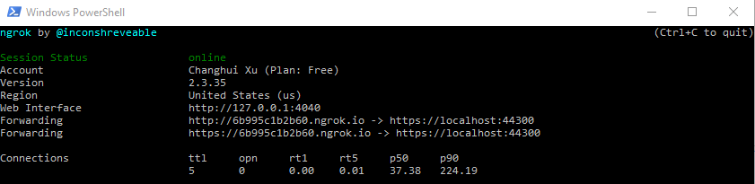
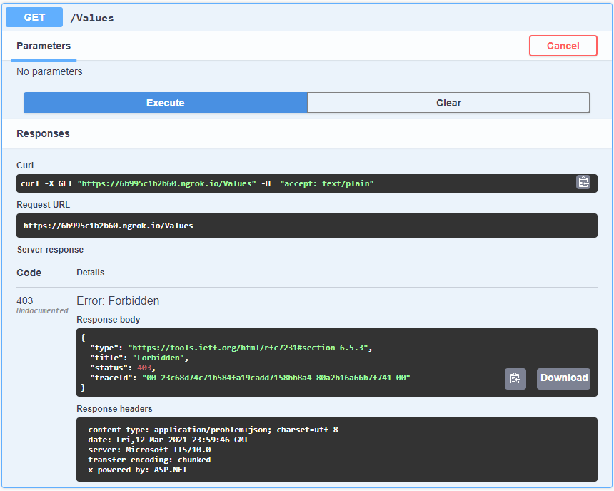

# Implementing and Testing IP SafeList in ASP.NET Core Web API projects

[](https://ko-fi.com/I3I63W4OK)

We sometimes want to limit our application to only certain IP addresses or IP network ranges. For example, during [beta testing](https://en.wikipedia.org/wiki/Software_testing), we prefer to only allow admins and limited testers to access the new website. Besides blocking the whole application, we sometimes want to expose most APIs in an application but restrict a few API endpoints to a confined network so that sensitive data won't be scraped.

IP restrictions can be done at several levels to achieve security goals. As developers, we can properly guard applications and API endpoints in our code so that they are available to only a list of network addresses. The official tutorial, _[Client IP safelist for ASP.NET Core](https://docs.microsoft.com/en-us/aspnet/core/security/ip-safelist)_, has documented different ways to implement an IP address safelist (aka an allow list) in an ASP.NET Core app.

In this article, we will go over some implementation details for allowing a list of IP addresses or CIDR blocks to access our API endpoints. We will use a NuGet package [IPNetwork2](https://www.nuget.org/packages/IPNetwork2/) to parse and check IP addresses and CIDR blocks. It's worth noting that the NuGet package [AzureIPNetworks](https://www.nuget.org/packages/AzureIPNetworks/) uses IPNetwork2 too.

We will create a middleware and an Action filter. We will write integration tests to verify the request pipeline. In the end, I will show you how to use `ngrok` to test the application from other computers other than our dev machine.

## Testing with `ngrok`

`ngrok` is a reverse proxy that creates a secure tunnel from a public endpoint to a locally running web service.

Download `ngrok` from its official site [https://ngrok.com/](https://ngrok.com/). Then start the app from Visual Studio (or VS Code), and run the executable in a PowerShell terminal using the following command.

```powershell
.\ngrok.exe http https://localhost:44300 -host-header="localhost:44300"
```



`ngrok` creates a public endpoint `https://6b995c1b2b60.ngrok.io` which enables people to visit the local instance `https://localhost:44300` in our development server.

Therefore, we can visit the URL that is given by `ngrok` from another computer. In this example, the link is [https://6b995c1b2b60.ngrok.io/swagger/index.html](https://6b995c1b2b60.ngrok.io/swagger/index.html). Whereas your link will be slightly different.

Try out the Swagger page, and you will get the results like below.



You should see a `403` response if your IP address is not in the safe list. Otherwise, you should see a `200` response.

## License

Feel free to use the code in this repository as it is under MIT license.

[](https://ko-fi.com/I3I63W4OK)
