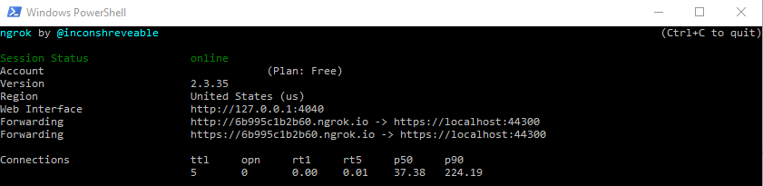

# Implementing IP SafeList in ASP.NET Core Web API projects

[](https://ko-fi.com/I3I63W4OK)

We sometimes want to only allow certain IP addresses or IP ranges to visit some API endpoints in an application or we restrict the whole application to those network addresses. The official documentation _[IP address safelist](https://docs.microsoft.com/en-us/aspnet/core/security/ip-safelist)_ has

In this article, we will go over some implementation details for allowing a list of IP addresses or CIDR blocks to access our API endpoints.
We will use a NuGet package [IPNetwork2](https://www.nuget.org/packages/IPNetwork2/) to parse and check IP addresses and CIDR blocks. It's worth noting that the NuGet package [AzureIPNetworks](https://www.nuget.org/packages/AzureIPNetworks/) uses IPNetwork2 too.

We will create a middleware and an Action filter.

## Usage

Download ngrok, run it from a PowerShell terminal using the following command

```powershell
.\ngrok.exe http https://localhost:44300 -host-header="localhost:44300"
```



Visit the URL that is given by ngrok. In this example, the link is [https://6b995c1b2b60.ngrok.io/swagger/index.html](https://6b995c1b2b60.ngrok.io/swagger/index.html). Whereas your link will be slightly different.

Try out the Swagger page like below.


You should see a `403` response if your IP address is not in the safe list. Otherwise, you should see a `200` response.

## License

Feel free to use the code in this repository as it is under MIT license.

[](https://ko-fi.com/I3I63W4OK)
